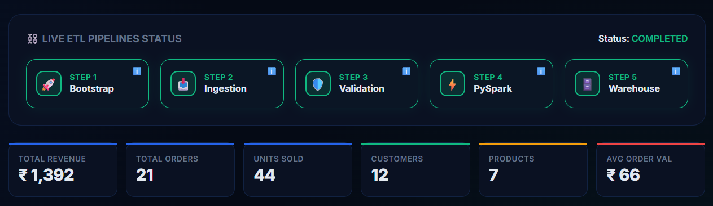
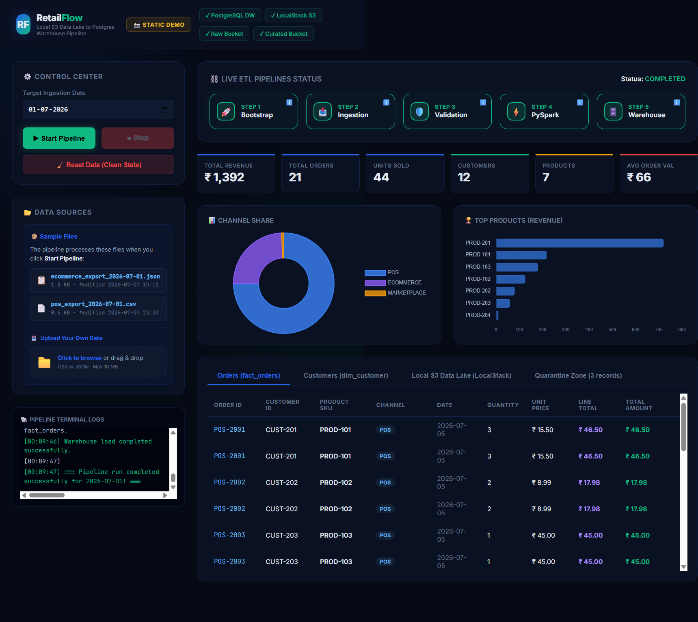
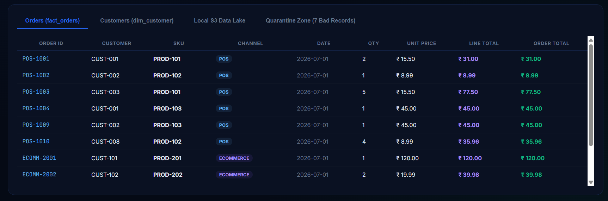
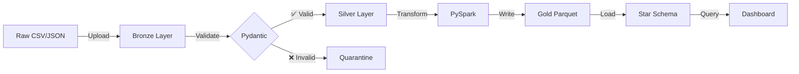

# 🛒 RetailFlow — Modern Data Lake → Warehouse Pipeline

<div align="center">

[](https://opensource.org/licenses/MIT)
[](https://www.python.org/)
[](https://spark.apache.org/)
[](https://www.postgresql.org/)
[](https://www.terraform.io/)
[](https://www.docker.com/)
[](https://localstack.cloud/)
[](https://flask.palletsprojects.com/)

</div>

> **A production-grade end-to-end data engineering pipeline** that ingests multi-source retail transactions, validates with Pydantic v2, transforms using PySpark, orchestrates with a modern web dashboard, and loads into a PostgreSQL Star Schema — all running **locally at zero cloud cost**.

<div align="center">



</div>

---

## 📋 Table of Contents

- [✨ Features at a Glance](#-features-at-a-glance)
- [👀 Quick Demo](#-quick-demo-no-setup-required)
- [🎯 What Problem Does This Solve?](#-what-problem-does-this-solve)
- [🏗️ Architecture](#️-architecture)
- [🛠️ Tech Stack](#️-tech-stack)
- [📂 Project Structure](#-project-structure)
- [🚀 Quick Start](#-quick-start)
  - [Prerequisites](#prerequisites)
  - [Method 1: Web Dashboard](#method-1-web-dashboard-recommended-)
  - [Method 2: Command Line](#method-2-command-line-interface-)
- [🔍 Validating Outputs](#-validating-outputs)
- [📊 Dashboard Features](#-dashboard-features)
- [🎓 Learning Resources](#-learning-resources)
- [🔧 Troubleshooting](#-troubleshooting)
- [☁️ Cloud Deployment Guide](#️-cloud-deployment-guide)
- [📦 Sample Data](#-sample-data)
- [🤝 Contributing](#-contributing)
- [📄 License](#-license)

---

---

## ✨ Features at a Glance

<table>
<tr>
<td width="33%" valign="top">

### 🎯 Production-Ready
- **Multi-source ingestion** (CSV + JSON)
- **Schema validation** with Pydantic v2
- **Quarantine layer** for bad records
- **Star Schema warehouse** design
- **Infrastructure as Code** with Terraform

</td>
<td width="33%" valign="top">

### 🚀 Modern Stack
- **LocalStack S3** (AWS-compatible)
- **PySpark** for distributed transforms
- **PostgreSQL 16** data warehouse
- **Flask + Chart.js** live dashboard
- **Docker Compose** orchestration

</td>
<td width="33%" valign="top">

### 💰 Zero Cost
- **No AWS charges** — runs 100% locally
- **No cloud dependencies**
- **Full feature parity** with production
- **Learn AWS patterns** risk-free
- **Portable to cloud** in minutes

</td>
</tr>
</table>

---

## 👀 Quick Demo (No Setup Required)

Want to see the dashboard without installing anything?

→ **[Open Static Demo](dashboard/static/demo.html)** *(pre-populated with real pipeline outputs)*

The static demo shows:
- ✅ Real-time pipeline execution logs
- 📊 KPI metrics and analytics charts  
- 📋 Fact tables and dimension tables
- 🗂️ S3 bucket structure visualization
- ⚠️ Quarantine records with validation errors

### 📸 Dashboard Preview

<div align="center">

#### Pipeline Execution Steps

*Real-time pipeline status with live logs and progress tracking*

#### KPI Analytics & Charts

*Revenue analytics, channel performance, and top-selling products*

#### Data Tables

*Fact tables with complete transaction details*

</div>

**Ready to run it yourself?** Continue to [Quick Start](#-quick-start).

---

## 🎯 What Problem Does This Solve?

Real retail businesses collect data from multiple disconnected systems:

| Source | Format | Challenges |
|--------|--------|------------|
| **Physical POS Terminals** | CSV exports | Inconsistent schemas, encoding issues, missing fields |
| **E-commerce Platforms** | JSON APIs | Nested data, type mismatches, dirty values |
| **Manual Entries** | Spreadsheets | Human errors, negative quantities, invalid dates |

### The Challenge
Traditional approaches either:
- ❌ **Crash on bad data** → pipeline failures, manual intervention
- ❌ **Skip validation** → garbage in warehouse, broken BI reports  
- ❌ **Require expensive cloud resources** → AWS bills before you've learned anything

### The RetailFlow Solution

This pipeline implements **production-grade data engineering patterns**:

1. **🔄 Bronze Layer (Raw Lake)** — Ingest everything as-is into S3, preserving source format
2. **✅ Silver Layer (Validated)** — Pydantic v2 enforces types, routing bad records to quarantine
3. **✨ Gold Layer (Curated)** — PySpark deduplicates, aggregates, converts to Parquet
4. **📊 Warehouse (Analytics-Ready)** — Star Schema loads into PostgreSQL for BI tools

**All orchestrated from a single web dashboard with real-time logs and analytics.**

---

## Dashboard Preview

<!-- SCREENSHOT: Pipeline step cards in "running" state -->
<!-- Suggested filename: images/pipeline_steps.png -->
<!-- Capture while pipeline is running to show the animated step cards -->
> **Screenshot placeholder** — run the live pipeline at `http://localhost:5050` and screenshot the step cards while running.
> Replace this block with: ``

<!-- SCREENSHOT: KPI metrics and charts after a completed run -->
<!-- Suggested filename: images/kpi_charts.png -->
> **Screenshot placeholder** — after a completed run, screenshot the KPI row + channel/SKU charts.
> Replace this block with: ``

<!-- SCREENSHOT: fact_orders table tab -->
<!-- Suggested filename: images/orders_table.png -->
> **Screenshot placeholder** — screenshot the Orders (fact_orders) tab.
> Replace this block with: ``

---

## 🛠️ Tech Stack

| Layer | Technology | Local | Production AWS | Why This Choice |
|-------|-----------|-------|----------------|-----------------|
| **Container Orchestration** | [Docker Compose](https://docs.docker.com/compose/) | ✅ | AWS ECS / EKS | Industry standard for local dev environments |
| **Object Storage** | [LocalStack S3](https://localstack.cloud/) | ✅ | [AWS S3](https://aws.amazon.com/s3/) | 100% API-compatible, instant cloud migration |
| **Infrastructure as Code** | [Terraform](https://www.terraform.io/) | ✅ | Same | Declarative, version-controlled infrastructure |
| **Schema Validation** | [Pydantic v2](https://docs.pydantic.dev/latest/) | ✅ | AWS Lambda / Glue | Fast, type-safe, battle-tested validation |
| **Data Transformation** | [PySpark 3.5](https://spark.apache.org/) | ✅ | [AWS Glue](https://aws.amazon.com/glue/) / [EMR](https://aws.amazon.com/emr/) | Distributed processing, handles petabyte scale |
| **Data Warehouse** | [PostgreSQL 16](https://www.postgresql.org/) | ✅ | [RDS](https://aws.amazon.com/rds/) / [Redshift](https://aws.amazon.com/redshift/) | ACID compliance, mature ecosystem |
| **API Backend** | [Flask 3.x](https://flask.palletsprojects.com/) | ✅ | AWS Lambda / ECS | Lightweight, Python-native, production-ready |
| **Dashboard Frontend** | Vanilla JS + [Chart.js 4](https://www.chartjs.org/) | ✅ | Same / S3+CloudFront | No framework bloat, works anywhere |
| **Python Dependencies** | boto3, pandas, pyarrow, psycopg2 | ✅ | Same | AWS SDK + data science essentials |

### Key Design Decisions

**Why LocalStack instead of mocking?**  
LocalStack runs an actual S3 HTTP server. Your code uses the real `boto3` client and PySpark's `s3a://` connector — no mocks, no shims. Switching to production AWS is literally changing one endpoint URL.

**Why Parquet for Gold layer?**  
Columnar storage compresses categorical fields (channel, SKU) by 60-80% vs CSV. Analytical queries scanning specific columns skip entire row groups. This is why AWS Glue and Redshift Spectrum default to Parquet.

**Why Star Schema over flat tables?**  
Separates slowly-changing dimensions (customer names, product categories) from high-volume facts. Dimension tables are small and cacheable; fact tables are append-only. Tableau, Power BI, and Looker expect this layout.

**Why quarantine instead of fail-fast?**  
Production pipelines **never** crash on bad data. Pydantic catches type errors, negative prices, missing fields, and invalid enums. Each bad record goes to `s3://retailflow-raw/quarantine/` with full error context for downstream alerting. Airbnb and Uber use this pattern.

---

## 🏗️ Architecture

```
┌─────────────────────────────────────────────────────────────────┐
│                     📁 Raw Data Sources                         │
│  pos_export_YYYY-MM-DD.csv      ecommerce_YYYY-MM-DD.json      │
│  (Physical POS Terminal)         (E-commerce Storefront)        │
└───────────────────────┬─────────────────────────────────────────┘
                        │ boto3 upload
                        ▼
        ┏━━━━━━━━━━━━━━━━━━━━━━━━━━━━━━━━━━━━━━━━━┓
        ┃  🪣 Bronze Layer (LocalStack S3)         ┃
        ┃  s3://retailflow-raw/raw/orders/         ┃
        ┃    └─ YYYY-MM-DD/pos.csv                 ┃
        ┃    └─ YYYY-MM-DD/ecommerce.json          ┃
        ┗━━━━━━━━━━━━━━━┯━━━━━━━━━━━━━━━━━━━━━━━━━┛
                        │ Pydantic v2 validation
                        ▼
        ┏━━━━━━━━━━━━━━━━━━━━━━━━━━━━━━━━━━━━━━━━━┓
        ┃  ✅ Silver Layer (Validation)            ┃
        ┃  ├─ Valid   → validated/orders/          ┃
        ┃  └─ Invalid → quarantine/orders/         ┃
        ┃     (type errors, negative prices, etc)  ┃
        ┗━━━━━━━━━━━━━━━┯━━━━━━━━━━━━━━━━━━━━━━━━━┛
                        │ PySpark SparkSession
                        ▼
        ┏━━━━━━━━━━━━━━━━━━━━━━━━━━━━━━━━━━━━━━━━━┓
        ┃  ✨ Gold Layer (Apache Parquet)          ┃
        ┃  s3://retailflow-curated/curated/        ┃
        ┃  • Deduplicated by order_id              ┃
        ┃  • Aggregated metrics per order          ┃
        ┃  • Columnar compression (60-80% saving)  ┃
        ┗━━━━━━━━━━━━━━━┯━━━━━━━━━━━━━━━━━━━━━━━━━┛
                        │ psycopg2 + pandas
                        ▼
        ┏━━━━━━━━━━━━━━━━━━━━━━━━━━━━━━━━━━━━━━━━━┓
        ┃  📊 PostgreSQL Data Warehouse            ┃
        ┃          Star Schema                     ┃
        ┃                                          ┃
        ┃    dim_customer      dim_product         ┃
        ┃           ↘              ↙               ┃
        ┃              fact_orders                 ┃
        ┃           ↗              ↖               ┃
        ┃      dim_date          (indexed)         ┃
        ┗━━━━━━━━━━━━━━━┯━━━━━━━━━━━━━━━━━━━━━━━━━┛
                        │ Flask REST API
                        ▼
        ┏━━━━━━━━━━━━━━━━━━━━━━━━━━━━━━━━━━━━━━━━━┓
        ┃  🎨 RetailFlow Web Dashboard             ┃
        ┃  Flask + Chart.js + Vanilla JS           ┃
        ┃  http://localhost:5050                   ┃
        ┃  • Real-time pipeline control            ┃
        ┃  • Live log streaming                    ┃
        ┃  • Interactive analytics                 ┃
        ┗━━━━━━━━━━━━━━━━━━━━━━━━━━━━━━━━━━━━━━━━━┛
```

### Pipeline Flow



---

## 📂 Project Structure

```
RetailFlow/
│
├── 📄 README.md                    ← You are here
├── 📄 requirements.txt             ← Python dependencies (Pydantic, PySpark, boto3, etc.)
├── 📄 docker-compose.yml           ← LocalStack S3 + PostgreSQL containers
│
├── 📁 bin/                         ← Terraform binary (auto-downloaded on Windows)
│   └── README.md
│
├── 📁 hadoop/                      ← Hadoop winutils for PySpark on Windows
│   ├── bin/winutils.exe
│   └── README.md
│
├── 📁 data/                        ← Sample transaction files
│   ├── README.md
│   └── sample_orders/
│       ├── pos_export_2026-07-01.csv          (11 records, 4 intentionally bad)
│       └── ecommerce_export_2026-07-01.json   (8 records, 3 intentionally bad)
│
├── 📁 infra/                       ← Terraform infrastructure as code
│   ├── main.tf                     (S3 bucket definitions)
│   ├── variables.tf
│   ├── outputs.tf
│   └── README.md
│
├── 📁 validators/                  ← Pydantic schemas + quarantine router
│   ├── order_schema.py             (OrderRecord model with strict validation)
│   └── README.md
│
├── 📁 ingestion/                   ← Bronze layer uploader
│   ├── upload_to_lake.py           (boto3 S3 client to raw/)
│   └── README.md
│
├── 📁 spark_jobs/                  ← PySpark transformation (Silver → Gold)
│   ├── transform_orders.py         (Deduplication, aggregation, Parquet write)
│   └── README.md
│
├── 📁 warehouse/                   ← Star Schema DDL + loader
│   ├── schema.sql                  (CREATE TABLE statements)
│   ├── load_to_postgres.py         (Parquet → PostgreSQL)
│   └── README.md
│
├── 📁 dashboard/                   ← Flask web control center
│   ├── server.py                   (REST API + pipeline orchestration)
│   ├── static/
│   │   ├── index.html              (Live dashboard with Chart.js)
│   │   └── demo.html               (Pre-populated static demo)
│   └── README.md
│
├── 📁 scripts/                     ← Setup/teardown automation
│   ├── setup.ps1                   (Windows: docker up + Terraform + schema)
│   ├── setup.sh                    (Linux/macOS equivalent)
│   ├── run_pipeline.ps1            (Execute full ETL pipeline)
│   ├── run_pipeline.sh
│   ├── teardown.ps1                (Clean shutdown)
│   └── teardown.sh
│
├── 📁 notebooks/                   ← Jupyter notebooks for EDA
│   ├── analysis.ipynb              (Exploratory data analysis)
│   └── README.md
│
└── 📁 images/                      ← Screenshots for documentation
```

### Module Responsibilities

| Module | Purpose | Key Files |
|--------|---------|-----------|
| **validators/** | Enforce data quality with Pydantic v2 type checking | `order_schema.py` |
| **ingestion/** | Upload raw CSV/JSON to Bronze layer S3 | `upload_to_lake.py` |
| **spark_jobs/** | PySpark ETL: deduplicate, aggregate, write Parquet | `transform_orders.py` |
| **warehouse/** | Star Schema DDL and Postgres loader | `schema.sql`, `load_to_postgres.py` |
| **dashboard/** | Flask REST API + Chart.js UI for control & analytics | `server.py`, `static/index.html` |
| **infra/** | Terraform IaC for S3 buckets (LocalStack or AWS) | `main.tf` |
| **scripts/** | PowerShell/Bash orchestration for full pipeline | `setup.ps1`, `run_pipeline.ps1` |

---

## 🚀 Quick Start

### Prerequisites

| Requirement | Version | Installation | Notes |
|-------------|---------|--------------|-------|
| **Docker Desktop** | Latest | [Download](https://www.docker.com/products/docker-desktop/) | Required for LocalStack + PostgreSQL |
| **Python** | 3.11+ | [Download](https://www.python.org/downloads/) | Pipeline runtime environment |
| **Java JDK** | 17 or 21 | [Download](https://adoptium.net/) | Required by PySpark's JVM |
| **Git** | Latest | [Download](https://git-scm.com/) | For cloning the repository |

#### Environment Variables (Windows)
After installing Java, ensure `JAVA_HOME` is set:
```powershell
# Check if JAVA_HOME is set
echo $env:JAVA_HOME

# If not, set it (adjust path to your JDK installation)
[System.Environment]::SetEnvironmentVariable('JAVA_HOME', 'C:\Program Files\Eclipse Adoptium\jdk-17.0.x-hotspot', 'Machine')
```

---

### Installation

```bash
# 1. Clone the repository
git clone https://github.com/yourusername/RetailFlow.git
cd RetailFlow

# 2. Install Python dependencies
pip install -r requirements.txt
```

---

### Method 1: Web Dashboard (Recommended) 🎨

The easiest way to run the entire pipeline with real-time monitoring.

#### Step 1: Start the Dashboard

```bash
python dashboard/server.py
```

You'll see:
```
RetailFlow Dashboard v3 - Full Infrastructure + Pipeline Control
Open your browser: http://localhost:5050
```

#### Step 2: Open in Browser

Navigate to **http://localhost:5050** and click **▶ Start Pipeline**

The dashboard will automatically:
- ✅ Start Docker containers (LocalStack S3 + PostgreSQL)
- ✅ Run Terraform to provision S3 buckets
- ✅ Apply database schema
- ✅ Execute all 4 ETL steps
- ✅ Display live logs and analytics

#### Step 3: Explore Analytics

Once complete, the dashboard shows:
- 📊 **KPI Cards**: Total orders, revenue, avg order value, unique customers
- 📈 **Charts**: Revenue by channel, top products by SKU
- 📋 **Tables**: Fact orders, dimensions, quarantined records
- 🗂️ **S3 Browser**: Inspect Bronze/Silver/Gold layers

---

### Method 2: Command Line Interface 💻

For automated runs or CI/CD integration.

#### Windows (PowerShell)

```powershell
# Setup infrastructure (one-time)
powershell.exe -ExecutionPolicy Bypass -File .\scripts\setup.ps1

# Run pipeline for specific date
powershell.exe -ExecutionPolicy Bypass -File .\scripts\run_pipeline.ps1 -TargetDate 2026-07-01

# Clean shutdown
powershell.exe -ExecutionPolicy Bypass -File .\scripts\teardown.ps1
```

#### Linux / macOS (Bash)

```bash
# Setup infrastructure (one-time)
./scripts/setup.sh

# Run pipeline for specific date
./scripts/run_pipeline.sh 2026-07-01

# Clean shutdown
./scripts/teardown.sh
```

---

### What a Successful Run Looks Like

```
=== RetailFlow Pipeline starting for 2026-07-01 ===

[Infrastructure] Starting Docker containers...
[Infrastructure] LocalStack S3 is ready!
[Infrastructure] PostgreSQL is ready!
[Infrastructure] S3 buckets provisioned successfully!
[Infrastructure] Database schema applied!

[Step 1/4] Ingesting raw POS & E-commerce exports...
  ✓ Uploaded pos_export_2026-07-01.csv → s3://retailflow-raw/raw/orders/2026-07-01/
  ✓ Uploaded ecommerce_export_2026-07-01.json → s3://retailflow-raw/raw/orders/2026-07-01/

[Step 2/4] Validating records with Pydantic...
  ✓ Validation complete: 11 valid, 7 quarantined
  ✓ Valid records → s3://retailflow-raw/validated/orders/2026-07-01/
  ✓ Bad records → s3://retailflow-raw/quarantine/orders/2026-07-01/

[Step 3/4] Running PySpark transformation...
  ✓ Reading: s3a://retailflow-raw/validated/orders/2026-07-01/
  ✓ Writing: s3a://retailflow-curated/curated/orders/processed_date=2026-07-01/
  ✓ Curated Parquet written (compression: 68%)

[Step 4/4] Loading to PostgreSQL warehouse...
  ✓ Inserted 9 rows → dim_customer
  ✓ Inserted 7 rows → dim_product
  ✓ Inserted 1 row → dim_date
  ✓ Loaded 11 rows → fact_orders

=== Pipeline run completed successfully in 43s ===
```

---

## 🔍 Validating Outputs

### Query the Data Warehouse

```bash
# View all loaded orders
docker exec -it retailflow-postgres psql -U postgres -d retailflow_dw \
  -c "SELECT order_id, customer_id, sku, channel, order_date, quantity, line_total FROM fact_orders ORDER BY order_date DESC;"

# Customer lifetime value analysis
docker exec -it retailflow-postgres psql -U postgres -d retailflow_dw \
  -c "SELECT c.customer_id, c.customer_name, COUNT(f.order_id) AS orders, SUM(f.line_total) AS ltv
      FROM dim_customer c JOIN fact_orders f ON c.customer_id = f.customer_id
      GROUP BY c.customer_id, c.customer_name ORDER BY ltv DESC;"

# Revenue by channel breakdown
docker exec -it retailflow-postgres psql -U postgres -d retailflow_dw \
  -c "SELECT channel, COUNT(*) AS orders, SUM(line_total) AS revenue
      FROM fact_orders GROUP BY channel ORDER BY revenue DESC;"

# Top-selling products
docker exec -it retailflow-postgres psql -U postgres -d retailflow_dw \
  -c "SELECT p.sku, p.product_name, SUM(f.quantity) AS units_sold, SUM(f.line_total) AS revenue
      FROM dim_product p JOIN fact_orders f ON p.sku = f.sku
      GROUP BY p.sku, p.product_name ORDER BY revenue DESC LIMIT 10;"
```

### Inspect S3 Data Lake Layers

```bash
# Bronze Layer — raw uploads (as-is from sources)
aws --endpoint-url=http://localhost:4566 s3 ls s3://retailflow-raw/raw/ --recursive

# Silver Layer — validated and cleaned data
aws --endpoint-url=http://localhost:4566 s3 ls s3://retailflow-raw/validated/ --recursive

# Gold Layer — curated Parquet (production-ready)
aws --endpoint-url=http://localhost:4566 s3 ls s3://retailflow-curated/curated/ --recursive

# Quarantine Zone — rejected records with error details
aws --endpoint-url=http://localhost:4566 s3 ls s3://retailflow-raw/quarantine/ --recursive
```

### Download and Inspect Parquet Files

```bash
# Download curated Parquet from S3
aws --endpoint-url=http://localhost:4566 s3 cp \
  s3://retailflow-curated/curated/orders/processed_date=2026-07-01/ \
  ./local_parquet/ --recursive

# View Parquet schema and data using Python
python -c "
import pandas as pd
import glob
files = glob.glob('./local_parquet/*.parquet')
for f in files:
    print(f'\n=== {f} ===')
    df = pd.read_parquet(f)
    print(df.info())
    print(df.head())
"
```

---

## 📊 Dashboard Features

The RetailFlow dashboard (`http://localhost:5050`) provides:

### 🎮 Pipeline Control
- **▶ Start Pipeline** — One-click full ETL execution
- **🧹 Reset** — Clear warehouse + S3, ready for fresh run
- **⏹️ Stop** — Gracefully terminate running pipeline
- **📅 Date Picker** — Process any date's data

### 📈 Real-Time Monitoring
- **Step Progress Cards** — Visual status for each pipeline stage (idle/running/completed/error)
- **Live Log Stream** — Tail-f style output with timestamps
- **Execution Timeline** — Start/end times for each step

### 📊 Analytics Views
- **KPI Cards**: Total orders, revenue, avg order value, unique customers, products, units sold
- **Revenue by Channel** (Bar chart) — Compare POS vs e-commerce vs web performance
- **Top SKUs** (Horizontal bar chart) — Best-selling products by revenue
- **Orders Table** — Full fact_orders with filtering and sorting
- **Customers Table** — Dimension data with lifetime value calculations
- **Quarantine Table** — Bad records with validation error details

### 🗂️ Infrastructure Health
- **S3 Browser** — Real-time view of Bronze/Silver/Gold layer files
- **Health Check** — PostgreSQL connection, S3 buckets, row counts
- **Upload Your Own Data** — Drag-and-drop CSV/JSON files to process

---

## 🎓 Learning Resources

### What You'll Learn
- **Data Engineering Patterns**: Bronze-Silver-Gold medallion architecture
- **Schema Validation**: Type-safe data quality with Pydantic v2
- **Distributed Processing**: PySpark for ETL at scale
- **Star Schema Design**: Dimensional modeling for analytics
- **Infrastructure as Code**: Terraform for reproducible environments
- **Containerization**: Docker Compose multi-service orchestration
- **AWS Services**: S3, Glue, RDS patterns (without AWS bills!)

### Recommended Reading
- [The Data Engineering Handbook](https://github.com/DataEngineer-io/data-engineer-handbook) — Free community resource
- [Fundamentals of Data Engineering](https://www.oreilly.com/library/view/fundamentals-of-data/9781098108298/) — O'Reilly book
- [Designing Data-Intensive Applications](https://dataintensive.net/) — Martin Kleppmann classic
- [The Data Warehouse Toolkit](https://www.kimballgroup.com/data-warehouse-business-intelligence-resources/books/) — Kimball's dimensional modeling bible

### Video Tutorials
- [Data Engineering Zoomcamp](https://github.com/DataTalksClub/data-engineering-zoomcamp) — Free 9-week course
- [Apache Spark Tutorial](https://spark.apache.org/docs/latest/quick-start.html) — Official quickstart

---

## 🔧 Troubleshooting

### Docker Issues

**Problem**: `docker compose up` fails with "Cannot connect to Docker daemon"
```powershell
# Solution: Start Docker Desktop manually
"C:\Program Files\Docker\Docker\Docker Desktop.exe"
# Wait 30-60 seconds for daemon to fully start
docker info  # Verify it's running
```

**Problem**: Containers already exist
```bash
# Solution: Remove existing containers
docker compose down
docker compose up -d
```

### PySpark Issues

**Problem**: `java.io.FileNotFoundException: winutils.exe` (Windows only)
```
Solution: The hadoop/bin/ folder should already contain winutils.exe
Verify $env:HADOOP_HOME is set correctly in your script
```

**Problem**: `py4j.protocol.Py4JJavaError: AWS credentials not found`
```
Solution: This is expected with LocalStack's mock credentials
Ensure endpoint_url points to http://localhost:4566
```

### PostgreSQL Issues

**Problem**: Connection refused to `localhost:5433`
```bash
# Solution: Check if container is running
docker ps | grep postgres

# Restart if needed
docker restart retailflow-postgres

# Check logs
docker logs retailflow-postgres
```

### LocalStack S3 Issues

**Problem**: `NoSuchBucket` error
```bash
# Solution: Recreate buckets with Terraform
cd infra
terraform destroy -auto-approve
terraform apply -auto-approve
```

### Validation Errors

**Problem**: All records going to quarantine
```
Check data/sample_orders/ files match expected schema:
- order_id (string, non-empty)
- channel (enum: "pos" | "ecommerce" | "web")
- quantity (positive integer)
- unit_price (positive float)
- order_date (valid ISO date: YYYY-MM-DD)
- customer_id (string, non-empty)
```

---

## ☁️ Cloud Deployment Guide

### Migrating to AWS

RetailFlow is designed for **zero-friction cloud migration**. Change endpoints, not code.

| Local Component | AWS Service | Migration Steps |
|-----------------|-------------|-----------------|
| **LocalStack S3** | **AWS S3** | 1. Remove `endpoint_url` from boto3 client<br>2. Configure AWS credentials (`aws configure`)<br>3. Update bucket names if needed |
| **PostgreSQL (Docker)** | **Amazon RDS** | 1. Provision RDS PostgreSQL instance<br>2. Update connection string in `DB_CONFIG`<br>3. Run `warehouse/schema.sql` on RDS |
| **PowerShell Scripts** | **Apache Airflow** | 1. Convert scripts to Airflow DAGs<br>2. Deploy to AWS MWAA (Managed Airflow)<br>3. Schedule with cron expressions |
| **PySpark (Local)** | **AWS Glue** | 1. Upload `spark_jobs/` to S3<br>2. Create Glue Job pointing to script<br>3. Configure Glue Data Catalog |
| **Terraform (LocalStack)** | **Terraform (AWS)** | 1. Remove `endpoints` block in provider<br>2. Set `region = "us-east-1"`<br>3. Run `terraform apply` |

### Example: AWS S3 Migration

**Local (LocalStack)**
```python
s3 = boto3.client(
    's3',
    endpoint_url='http://localhost:4566',  # Remove this line
    aws_access_key_id='mock',               # Use real credentials
    aws_secret_access_key='mock'
)
```

**Production (AWS)**
```python
s3 = boto3.client('s3')  # Auto-detects AWS credentials from ~/.aws/credentials
```

### Cost Estimation (AWS)

Running this pipeline on AWS for 1 year (daily runs):

| Service | Configuration | Monthly Cost |
|---------|--------------|--------------|
| **S3 Storage** | 10 GB Standard, 1000 requests | ~$0.50 |
| **RDS PostgreSQL** | db.t3.micro (1 vCPU, 1GB RAM) | ~$15 |
| **AWS Glue** | 1 DPU-hour/day × 30 days | ~$13 |
| **Data Transfer** | Minimal (<1 GB/mo) | ~$0.10 |
| **Total** | | **~$29/month** |

*Prices as of 2026, us-east-1 region. Use [AWS Pricing Calculator](https://calculator.aws/) for exact estimates.*

### Deployment Checklist

- [ ] AWS account with admin access
- [ ] Configure AWS CLI (`aws configure`)
- [ ] Create S3 buckets (`terraform apply` in `infra/`)
- [ ] Provision RDS PostgreSQL instance
- [ ] Upload Python dependencies to Lambda layer or EMR
- [ ] Configure IAM roles for Glue/Lambda
- [ ] Set up CloudWatch logging
- [ ] Configure Airflow DAG schedule
- [ ] Test with small dataset first

---

## 📦 Sample Data

The pipeline includes **intentionally realistic test data** with both valid and invalid records to demonstrate validation.

### Included Files

| File | Format | Total | Valid | Invalid | Issues Demonstrated |
|------|--------|-------|-------|---------|---------------------|
| **pos_export_2026-07-01.csv** | CSV | 11 | 7 | 4 | Missing dates, negative quantities, negative prices, invalid channels |
| **ecommerce_export_2026-07-01.json** | JSON | 8 | 5 | 3 | Zero quantities, negative prices, empty customer IDs |

### Validation Rules (Pydantic Schema)

```python
class OrderRecord(BaseModel):
    order_id: str = Field(min_length=1)
    customer_id: str = Field(min_length=1)
    sku: str = Field(min_length=1)
    channel: Literal["pos", "ecommerce", "web"]
    quantity: int = Field(gt=0)
    unit_price: Decimal = Field(gt=0, decimal_places=2)
    order_date: date
```

### Using Your Own Data

#### Option 1: Dashboard Upload (Easiest)

1. Open `http://localhost:5050`
2. Click **📁 Upload Data** tab
3. Drag-and-drop your CSV or JSON file
4. Click **▶ Start Pipeline**

#### Option 2: Manual File Placement

```bash
# Replace sample files
cp your_pos_data.csv "data/sample_orders/pos_export_2026-07-01.csv"
cp your_ecommerce_data.json "data/sample_orders/ecommerce_export_2026-07-01.json"

# Run pipeline
python dashboard/server.py
# Click Start Pipeline in browser
```

### Expected CSV Format

```csv
order_id,customer_id,sku,channel,quantity,unit_price,order_date
ORD-001,CUST-123,SKU-WIDGET-A,pos,2,29.99,2026-07-01
ORD-002,CUST-456,SKU-GADGET-B,ecommerce,1,149.99,2026-07-01
```

### Expected JSON Format

```json
[
  {
    "order_id": "ORD-101",
    "customer_id": "CUST-789",
    "sku": "SKU-DEVICE-C",
    "channel": "web",
    "quantity": 3,
    "unit_price": 79.99,
    "order_date": "2026-07-01"
  }
]
```

---

## 🤝 Contributing

Contributions are welcome! This project is designed to be a learning resource for the data engineering community.

### Ways to Contribute

- 🐛 **Bug Reports** — Open an issue with reproduction steps
- 💡 **Feature Requests** — Suggest new data sources, transformations, or analytics
- 📝 **Documentation** — Improve READMEs, add code comments, write tutorials
- 🔧 **Code** — Submit PRs for bug fixes or new features
- ⭐ **Star the Repo** — Help others discover this project

### Development Setup

```bash
# Fork and clone
git clone https://github.com/YOUR_USERNAME/RetailFlow.git
cd RetailFlow

# Create feature branch
git checkout -b feature/your-feature-name

# Make changes, test locally
python dashboard/server.py

# Commit with clear messages
git commit -m "feat: add support for XML data sources"

# Push and open PR
git push origin feature/your-feature-name
```

### Code Style

- **Python**: Follow PEP 8, use type hints where possible
- **SQL**: Uppercase keywords, snake_case for tables/columns
- **Documentation**: Update relevant READMEs when changing modules

### Future Roadmap

- [ ] Support for XML and Avro data sources
- [ ] Real-time streaming with Kafka + Spark Structured Streaming
- [ ] dbt integration for transformation layer
- [ ] Great Expectations for advanced data quality checks
- [ ] Airflow DAG templates for production orchestration
- [ ] Pre-built Docker image for one-command setup
- [ ] Snowflake schema variant for complex hierarchies
- [ ] Machine learning features (customer churn prediction)

---

## 📄 License

This project is licensed under the **[MIT License](https://opensource.org/licenses/MIT)** — free to use, modify, and distribute.

```
MIT License

Copyright (c) 2026 RetailFlow Contributors

Permission is hereby granted, free of charge, to any person obtaining a copy
of this software and associated documentation files (the "Software"), to deal
in the Software without restriction, including without limitation the rights
to use, copy, modify, merge, publish, distribute, sublicense, and/or sell
copies of the Software, and to permit persons to whom the Software is
furnished to do so, subject to the following conditions:

The above copyright notice and this permission notice shall be included in all
copies or substantial portions of the Software.

THE SOFTWARE IS PROVIDED "AS IS", WITHOUT WARRANTY OF ANY KIND, EXPRESS OR
IMPLIED, INCLUDING BUT NOT LIMITED TO THE WARRANTIES OF MERCHANTABILITY,
FITNESS FOR A PARTICULAR PURPOSE AND NONINFRINGEMENT. IN NO EVENT SHALL THE
AUTHORS OR COPYRIGHT HOLDERS BE LIABLE FOR ANY CLAIM, DAMAGES OR OTHER
LIABILITY, WHETHER IN AN ACTION OF CONTRACT, TORT OR OTHERWISE, ARISING FROM,
OUT OF OR IN CONNECTION WITH THE SOFTWARE OR THE USE OR OTHER DEALINGS IN THE
SOFTWARE.
```

---

## 🙏 Acknowledgments

Built with these amazing open-source projects:

- [Apache Spark](https://spark.apache.org/) — Distributed data processing engine
- [PostgreSQL](https://www.postgresql.org/) — World's most advanced open-source database
- [LocalStack](https://localstack.cloud/) — Local AWS cloud stack
- [Terraform](https://www.terraform.io/) — Infrastructure as code
- [Flask](https://flask.palletsprojects.com/) — Lightweight Python web framework
- [Chart.js](https://www.chartjs.org/) — Beautiful JavaScript charts
- [Pydantic](https://docs.pydantic.dev/) — Data validation using Python type hints
- [Docker](https://www.docker.com/) — Container platform

Special thanks to the data engineering community for sharing knowledge and best practices.

---

## 📞 Support & Contact

- **Issues**: [GitHub Issues](https://github.com/utsavmehta24/RetailFlow/issues)
- **Email**: utsavmehta24072003@gmail.com
- **Twitter**: [@Lucid24by7_io](https://x.com/Lucid24by7_io)

---

<div align="center">

**⭐ Star this repo if you found it helpful!**

Made with ❤️ for the Data Engineering community

[Report Bug](https://github.com/utsavmehta24/RetailFlow/issues) · [Request Feature](https://github.com/utsavmehta24/RetailFlow/issues) · [View Demo](dashboard/static/demo.html)

</div>
